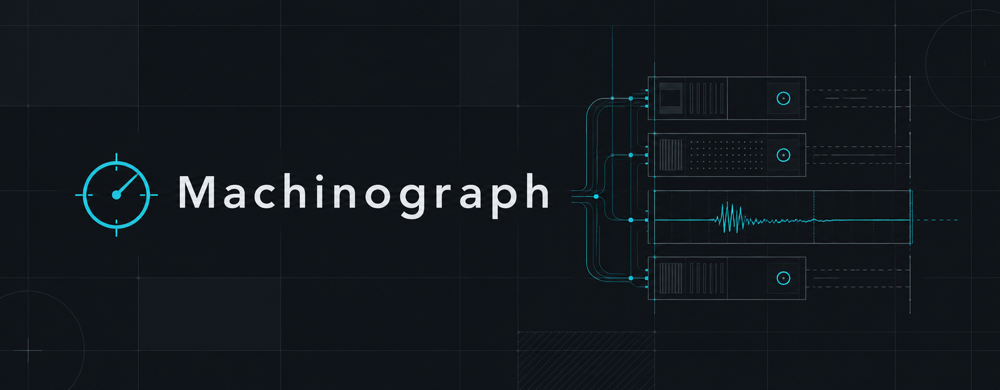
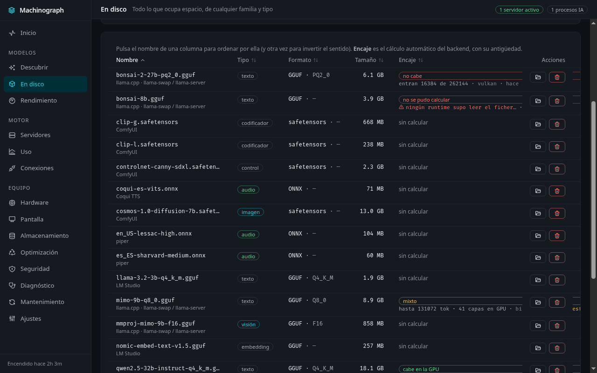
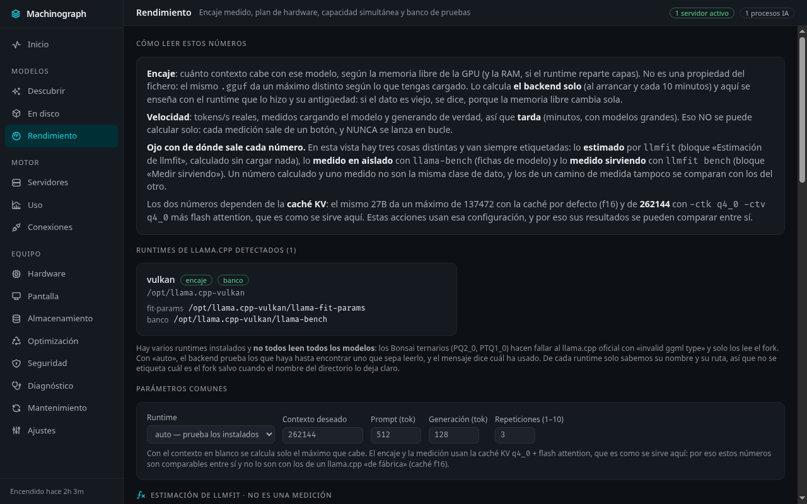
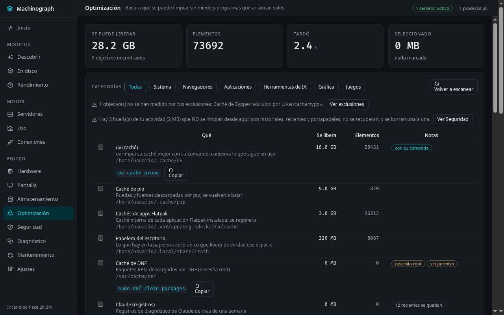
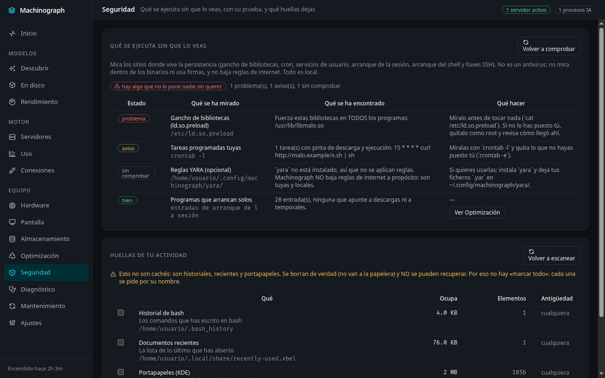
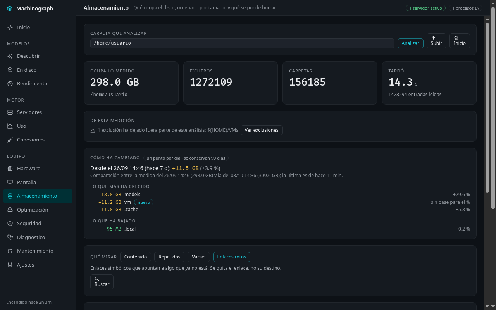
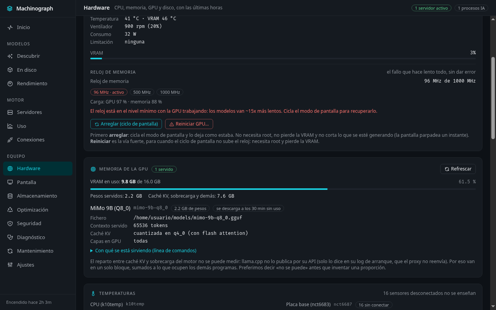
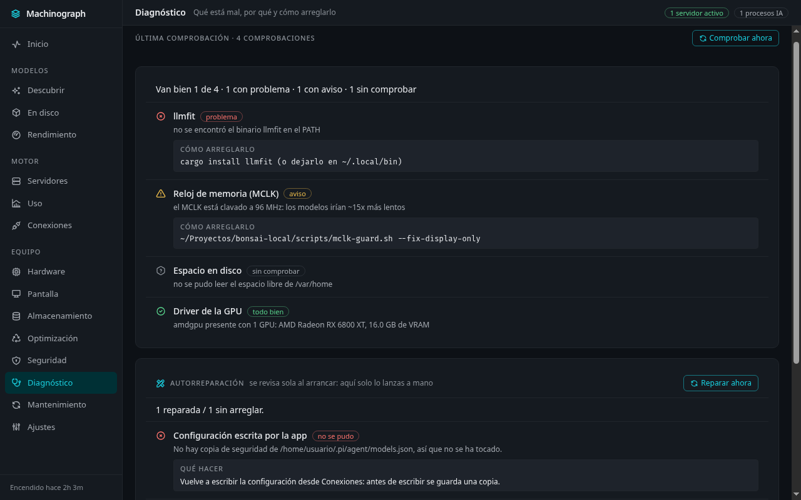

# Machinograph

**Tu equipo y tu IA local, a la vista.**

Machinograph es una aplicación de escritorio que reúne en una sola ventana todo lo que hace falta para
entender y gobernar la inteligencia artificial que corre en tu propia máquina: cómo va el equipo,
qué modelos tienes, cuáles te caben, quién los está sirviendo, cuánto ocupan, qué se puede limpiar
sin miedo y qué se está ejecutando sin que lo veas.

No hay nube, no hay cuentas y no hay telemetría: **todo pasa en tu ordenador**.

Las descargas están en la pestaña de [versiones](releases) de este repositorio.

---

## Qué puedes hacer con él

**Ver cómo va el equipo, de un vistazo.** Procesador, memoria, tarjeta gráfica, discos y pantallas,
con su histórico de las últimas horas. Cada cifra dice de dónde sale: si es una medida, es una
medida; si es una estimación, lo pone.

**Saber qué modelos tienes y cuáles te caben.** Machinograph enseña todo lo que hay en disco, de
cualquier familia —texto, visión, imagen, vídeo, audio, embeddings— con lo que ocupa cada uno, y
calcula con tu hardware real qué modelos pueden entrar y con qué contexto.

**Medir de verdad, no suponer.** Cuando quieres saber cuánto corre un modelo en tu máquina, Machinograph
lo mide: tokens por segundo reales, el encaje calculado por el planificador de llama.cpp y el
desglose de memoria del modelo que está sirviendo en ese momento.

**Limpiar basura sin miedo.** Cachés, temporales y registros que se regeneran solos, medidos uno a
uno, con su comando cuando lo limpia mejor la herramienta original. Lo que necesita permisos de
administrador no se toca a escondidas: se enseña el comando exacto.

**Recuperar espacio que ya está en tu disco.** Machinograph mide el espacio que se puede recuperar
compactando las bases de datos de las aplicaciones (navegadores, editores, mensajería) y lo hace
él mismo, sin instalar nada, sin tocar las que estén en uso y avisando de lo que ha liberado de
verdad.

**Ver cómo crece tu disco.** Machinograph guarda una medida al día de tu carpeta personal y de tus
modelos y las compara: cuánto ha cambiado desde la última vez y qué carpetas han crecido —y cuáles
han bajado—. Cada cifra dice de cuándo es, y avisa si la medida quedó incompleta.

**Saber qué se ejecuta sin que lo veas.** Qué programas arrancan solos, qué tareas hay programadas,
qué hay enganchado al arranque de tu sesión y qué llaves pueden entrar en tu equipo sin contraseña,
cada cosa con la prueba delante.

**Y borrar tus huellas cuando tú quieras.** Historiales, documentos recientes y portapapeles, uno a
uno, avisando de que no se recuperan.

---

## Cómo se ve

*Inicio: qué está pasando y qué te toca atender.*

*Todo lo que tienes, con su tipo, su tamaño y el encaje calculado para tu equipo.*

*Medido y estimado, cada uno con su etiqueta: nunca se mezclan.*

*Qué se puede tirar sin miedo, cuánto se libera y qué está en uso ahora mismo.*

*Qué se ejecuta solo, con la prueba de cada hallazgo y sin llamarlo antivirus, porque no lo es.*

*Qué ocupa el disco, ordenado por tamaño, y qué ha cambiado desde la última medida.*

*Cómo va el equipo por dentro, con las series de las últimas horas.*

*Qué está mal, por qué, cómo arreglarlo y qué se ha reparado solo.*

---

*Las capturas están hechas con datos de ejemplo.*

---

## Instalar

Descarga el paquete de tu sistema desde la [última versión](releases/latest):

| Sistema | Qué descargar |
| --- | --- |
| **Linux** | `.AppImage` (se ejecuta tal cual) o `.deb` |
| **macOS** | `.dmg` (arrastra la aplicación a tu carpeta de aplicaciones) |
| **Windows** | `.exe` (instalador) |

Los paquetes **no están firmados** con certificados de pago, así que el sistema puede avisarte la
primera vez (en macOS tendrás que permitirlo en «Seguridad y privacidad», y en Windows puede
aparecer el aviso de SmartScreen). Es la única consecuencia de no pagar un certificado; el programa
es el mismo.

**Machinograph se instala solo lo que necesita.** Para medir y para descargar modelos usa herramientas
libres (llmfit y llama.cpp). No tienes que buscar nada: la aplicación las descarga de sus versiones
oficiales por ti, comprueba que no están alteradas y las guarda dentro de su propia carpeta. Lo que
de verdad necesita permisos de administrador **no se instala solo**, y te dice el comando exacto.

---

## Lo que hace diferente

- **Medido, no supuesto.** Donde otras herramientas estiman, esta mide; y cuando solo puede estimar,
  lo dice al lado del número.
- **Nada inventado.** Si un dato no está, no se enseña. Si algo no se ha podido comprobar, pone «sin
  comprobar» en vez de «todo bien».
- **Todo local.** Ni una petición sale de tu equipo salvo las descargas que tú pides.
- **Sin fricción.** Detecta, instala y repara lo que necesita por su cuenta. Si algo se rompe (una
  base de datos dañada, un puerto ocupado), lo arregla y te cuenta qué ha hecho.
- **Tres sistemas.** Linux, macOS y Windows, con el mismo programa.

## Documentación

- [Guía de desarrollo](docs/DESARROLLO.md): cómo se compila, cómo se prueba y qué decisiones hay
  detrás de cada pantalla.
- [Sistema de diseño](DESIGN.md): colores, tipografía y las reglas de interfaz que sigue el panel.

## Créditos y licencia

Machinograph es software libre con licencia **MIT**. El catálogo de limpieza está portado de
[Kudu](https://github.com/adventdevinc/kudu) (MIT), y las mediciones y descargas se apoyan en
[llmfit](https://github.com/AlexsJones/llmfit) y [llama.cpp](https://github.com/ggml-org/llama.cpp)
(ambos MIT). Los detalles, en [LICENSE](LICENSE).
