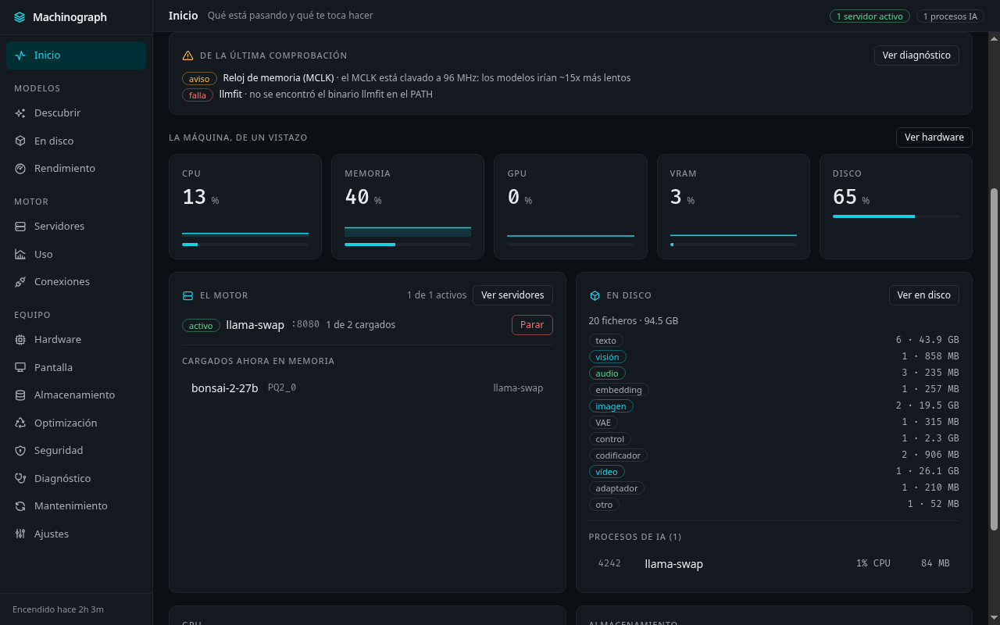

# Machinograph

Panel de escritorio que reúne en una sola ventana lo que normalmente hay que mirar en cinco
sitios: el uso del equipo, la tarjeta gráfica, las pantallas conectadas, los modelos que hay en
disco y el estado de los servidores de IA locales (llama-swap, Ollama, vLLM, ComfyUI…).

Aplicación Tauri 2: el backend es Rust (lee `/proc`, `/sys` y habla con los servidores por HTTP) y
la interfaz es web (React). El binario pesa ~11 MB y no necesita nada más para arrancar.

Además de mirar, hace tres cosas que suelen requerir tres herramientas distintas: **calcula qué
modelo te cabe** con el planificador nativo de llama.cpp, **mide** tokens/s reales (en aislado y
sirviendo), y **detecta y conecta los clientes de IA** de este equipo a un endpoint local.



## Qué hay en cada sección

La barra lateral va **agrupada en cuatro bloques** (y Ajustes aparte), porque con doce
secciones planas no se sabía qué había dónde: «Modelos» e «Inventario» leían la misma
fuente, y «Panel» y «Sistema» partían el hardware en dos. Cada sección lleva **una línea
que dice para qué es**, en la cabecera y en el `title` de su botón.

| Grupo | Sección | Contenido |
| --- | --- | --- |
| — | **Inicio** | Qué está pasando y qué te toca: los avisos con remedio (el reloj de memoria de la GPU clavado, un servidor vivo que no contesta, comprobaciones en rojo), la máquina en cinco cifras, quién sirve y qué modelos tiene cargados, y qué ocupa el disco |
| **Modelos** | **Descubrir** | Qué modelos le encajan a este equipo, con la nota y los tokens/s **estimados** por [llmfit](https://github.com/AlexsJones/llmfit). Un **deslizador** entre «más rápido» y «más capaz» reordena la lista con los componentes de llmfit, y el modelo recomendado enseña su **perfil en cinco ejes** (velocidad, calidad, encaje, contexto y holgura) diciendo de qué dato sale cada uno |
| | **En disco** | **Todo** lo que ocupa espacio, de cualquier familia (llama.cpp, LM Studio, ComfyUI, piper, Coqui…) y tipo (texto, visión, imagen, vídeo, audio, embedding, adaptador): buscador, filtros y **el encaje medido** de los `.gguf` de texto |
| | **Rendimiento** | Tres ejes, cada uno rotulado como lo que es: el **encaje** calculado con `llama-fit-params` (medido), el **plan de hardware y la capacidad simultánea** (estimación de llmfit) y las **mediciones** de tokens/s, en aislado y sirviendo |
| **Motor** | **Servidores** | Estado de cada servidor de IA: si el proceso está vivo, en qué puerto, qué modelos sirve, su log bajo demanda, y botones para levantarlo o pararlo |
| | **Conexiones** | Qué cliente de IA (gentle-shell, mcode, Codex) hay en el equipo, dónde está su configuración, qué líneas lo demuestran y dónde se puede escribir con garantías |
| **Equipo** | **Hardware** | CPU, memoria, GPU (temperatura, potencia, ventilador, VRAM) y disco, con el detalle de la GPU, el **reloj de memoria** vigilado y las series guardadas de las últimas horas |
| | **Pantalla** | Salidas, modos disponibles y la acción de reaplicar (el caso típico: el monitor que se queda en 60 Hz o no despierta tras suspender) |
| | **Almacenamiento** | El analizador de disco: lo que ocupa cada carpeta y cada fichero con su tamaño recursivo, **ordenado por tamaño**, con bajada de carpeta, búsqueda por nombre, los ficheros más grandes y el uso de cada disco; y el borrado de lo seleccionado, a la papelera o definitivo |
| | **Optimización** | Qué basura se puede tirar sin miedo (cachés, temporales y registros que se regeneran, medidos uno a uno) y qué programas **arrancan solos** con la sesión, con su comando y su interruptor |
| | **Seguridad** | Qué se ejecuta **sin que lo veas** —con el gancho de bibliotecas, el cron, los servicios de usuario, el arranque del shell y las llaves SSH— **con la prueba de cada hallazgo**, y qué **huellas de tu actividad** dejas (historiales, recientes, portapapeles), para borrarlas una a una |
| | **Diagnóstico** | Una comprobación del equipo bajo demanda: qué está mal, **por qué** y **cómo arreglarlo**. Lo que falla va primero |
| | **Mantenimiento** | Lanzador de comandos con la salida en vivo, historial de lo ejecutado y registro de las acciones de la app |
| — | **Ajustes** | Dónde escucha la **puerta de enlace** (solo este equipo, solo tu red o todas) y la URL con la que se llega desde otro equipo, el **arranque al iniciar sesión** (con el fichero que escribe), las **carpetas de modelos** que se recorren de verdad, el alta y baja de servidores, y los ajustes que el backend lee (ritmo de la foto y retención de métricas) |

## Estado

Verificado en esta máquina (Bazzite, KDE Plasma en Wayland, Radeon RX 6800 XT), ejecutando el
binario release real:

- Arranca desde el lanzador instalado, abre ventana y muestra datos reales: CPU, memoria, GPU
  (temperatura, potencia y VRAM leídas de `sysfs`), disco, `llama-swap` activo con sus modelos y la
  pantalla `DP-1` a 3840×2160@144 Hz leída con `kscreen-doctor`.
- La ventana **se refresca sola** cada 2 s (los eventos `ai:snapshot` llegan de verdad al frontend).
- **313 pruebas** de Rust en verde (y 5 de integración marcadas, que necesitan modelos o ficheros reales) y **37 comprobaciones de interfaz** en verde sobre el `dist` real
  (ver *Cómo se comprueba*). El analizador de disco recorre el home real (298 GB, 1,27 M ficheros) en
  ~14 s; el catálogo de limpieza mide **45,4 GB recuperables en 328.934 elementos** y encuentra 5
  huellas de actividad; la revisión de seguridad hace 8 comprobaciones y la de bases SQLite mide las
  que hay en este equipo. Todo comprobado con el backend de verdad.
- `pnpm typecheck` y `pnpm build` salen limpios, y `cargo build` no da **ni un aviso** —tampoco en el
  build cruzado de Windows—.
- El binario release no depende de nada instalado a mano: `ldd` lo resuelve todo contra `/usr/lib64`.

## Alcance por plataforma

Machinograph es multiplataforma, y aquí se dice **con qué evidencia**, porque no es lo mismo «compila y sus
pruebas pasan en ese sistema» que «lo he usado ahí»:

| | Linux | macOS | Windows |
| --- | --- | --- | --- |
| Uso real verificado | **Sí** (Bazzite, KDE Wayland, Radeon RX 6800 XT) | No | No |
| Compila y pasa las pruebas (CI, matriz de 3 sistemas) | Sí | Sí | Sí |
| Instalador que genera el CI | `.deb` + `.AppImage` | `.app` + `.dmg` | `.exe` (NSIS) |
| Reglas de limpieza (portadas de Kudu) | 126 | 130 | 197 |
| Papelera | freedesktop (`Trash/files` + `.trashinfo`, con limpieza de fichas huérfanas) | `~/.Trash` | Papelera de reciclaje (crate `trash`) |
| Arranque de la propia app | `.desktop` en `~/.config/autostart` | LaunchAgent en `~/Library/LaunchAgents` (`launchctl`) | valor en `HKCU\...\Run` (`reg`) |
| Programas que arrancan solos | XDG Autostart (+ tapar lo del sistema con `Hidden=true`) | LaunchAgents (`launchctl disable`) | clave `Run` de HKCU + carpeta Inicio |
| Qué se ejecuta sin que lo veas (Seguridad) | `ld.so.preload`, `crontab`, unidades de usuario, `~/.bashrc`…, `~/.ssh` | LaunchAgents + `launchctl list`, perfiles de shell | `schtasks`, clave `Run`, perfiles de PowerShell |
| Pantalla | `kscreen-doctor` (KDE Wayland) / `xrandr` (X11), y **se puede cambiar el modo** | `system_profiler` (ver, no cambiar) | WMI (ver, no cambiar) |
| GPU | `sysfs` amdgpu + `amd-smi` (uso, temperatura, potencia) | `system_profiler` (nombre, VRAM, driver) | WMI (nombre, VRAM, driver) |
| Sensores (`/sys/class/hwmon`) | Sí | No hay equivalente sin root: se dice | No hay equivalente sin elevación: se dice |
| Protección de borrado | raíces de Linux + cachés/temporales permitidos | `/System`, `/Library`, `/Applications`, `/private`, `/Volumes`… | raíces de unidad, `Windows`, `Program Files`, `ProgramData`, `Users`, y los temporales de `%TEMP%` como permitidos |
| Límite de tiempo de los comandos | Nativo (`Child::kill`), sin depender de `timeout(1)` | igual | igual |
| Herramientas que la app instala sola | llmfit + llama.cpp (release oficial, sha256) según el sistema | igual | igual |
| Autorreparación | puerto libre, base apartada si está rota, arranque propio | igual | igual |
| Cómo se comprueba además | CI (pruebas + instalador + CLI) | CI | CI **y** compilación cruzada desde Linux (`cargo zigbuild`, cero avisos) |

Lo que **no** cambia por plataforma: el motor de limpieza, el analizador de disco, la puerta de
enlace, las métricas, los bancos de pruebas y el CLI. Y lo que solo existe en Linux se dice en su
sección (por ejemplo, el reloj de memoria de la GPU o los sensores `hwmon`), en vez de fingirlo.

Las columnas de macOS y Windows significan lo que significan: **el código está escrito, compila en su
sistema y sus pruebas pasan** (eso lo comprueba el CI en los tres, y el CI **empaqueta el instalador
de cada uno**), pero no se ha ejecutado en una máquina de verdad, así que no se promete que todo
funcione igual. Es la misma regla que se aplica a todo el panel: lo que no se ha comprobado, se dice.

**Sobre el instalador en tu máquina:** `pnpm tauri build` compila el binario, pero de fábrica
`bundle.active` está en `false`, así que **no** genera paquetes. Para generar el instalador de tu
sistema hay que pedirlo explícitamente (`pnpm tauri build --bundles deb,appimage` en Linux, `--bundles
app,dmg` en macOS, `--bundles nsis` en Windows). En Linux, además, el empaquetador necesita las
bibliotecas de desarrollo del indicador de bandeja (`libayatana-appindicator3-dev`), que en un
escritorio normal no están: sin ellas el binario se compila igual, pero el paquete no. El CI sí las
instala y es donde se comprueba que el instalador sale.

## Stack

- **Tauri 2** + Rust (backend) y **Vite 8 + React 19 + TypeScript** (interfaz).
- **Tailwind v4** con los tokens de color en `src/styles.css` (nada de colores sueltos por ahí).
- **zustand** para el estado, **@tabler/icons-react** para los iconos.
- **rusqlite** (SQLite embebido, en modo WAL) para métricas, acciones, encajes, mediciones y ajustes.
- pnpm y Biome según las normas del proyecto; nada de `npm`.

## Compilar

```bash
pnpm install
source assets/entorno-build.sh      # solo en Bazzite: ver más abajo
pnpm exec tauri build --no-bundle
```

El binario queda en `src-tauri/target/release/machinograph`.

Para desarrollo, `pnpm tauri:dev` (levanta Vite y la ventana con recarga en caliente).

### El entorno de compilación en Bazzite (importante)

Bazzite es Fedora atómico: trae las bibliotecas de **ejecución** de GTK y WebKit, pero no los
paquetes `-devel`, y Tauri necesita `pkg-config` y los enlaces `libX.so` sin número de versión para
enlazar. Si no se hace nada, la compilación falla al enlazar con
`unable to find library -lgtk-3 / -lwebkit2gtk-4.1 / …`.

`assets/entorno-build.sh` apunta `PKG_CONFIG_PATH` a un *overlay* con los `.pc` y los encabezados de
los RPM de desarrollo, extraídos fuera del sistema (`~/.local/share/machinograph-build/overlay`), con los
enlaces resolviendo a las bibliotecas del sistema. Hay que hacerle `source` antes de compilar; el
script comprueba que `pkg-config` resuelva de verdad `webkit2gtk-4.1`, `gtk+-3.0`, etc. y avisa si
falta algo.

La alternativa «limpia», si algún día se quiere prescindir del overlay, es instalar los paquetes de
desarrollo en el sistema:

```bash
rpm-ostree install gtk3-devel webkit2gtk4.1-devel javascriptcoregtk4.1-devel libsoup3-devel
# requiere reiniciar la máquina
```

Se compila con `--no-bundle` porque el empaquetado (`.deb`/`.rpm`/AppImage) no se usa: la
instalación local se hace con `assets/instalar.sh`.

## Cómo se comprueba

```bash
pnpm typecheck                  # tipos del frontend (tsc --noEmit)
pnpm build                      # build del frontend
cd src-tauri && cargo test      # 313 pruebas del backend (y 5 de integración marcadas)
```

Dos niveles, y los dos hacen falta:

1. **Pruebas de Rust (313, más 5 de integración marcadas con `#[ignore]`).** Cubren los parsers que más fácil se rompen, con salidas **reales**
   capturadas de esta máquina: `kscreen-doctor`, `xrandr`, `llama-fit-params`, `llama-bench`, las
   cuatro salidas de `llmfit` (que van como *fixtures* en `src-tauri/fixtures/`) y las de `amd-smi`.
   Son funciones puras justo para eso. Además hay pruebas de las decisiones que no se ven en
   pantalla: que un contexto imposible se acote antes de llamar al planificador, que una base de
   datos que no se puede abrir **no** mate el proceso, que el borrado no salga nunca de las carpetas
   de modelos, y que el puente de conexiones no escriba nada si el fichero no es el que esperaba.
2. **Comprobaciones de interfaz (37).** Sobre el `dist` compilado, en Brave por CDP y con el puente
   Tauri **simulado con el contrato real** (en un navegador no hay backend Rust): foco y teclado,
   ordenación con `aria-sort`, estados vacíos, el aviso de base de datos caída, la escritura en dos
   pasos del puente de conexiones, la **navegación agrupada con el propósito de cada sección**, que el
   **analizador de disco** ordena y baja de carpeta y que su borrado por defecto va a la **papelera**,
   que la **limpieza** no deja tocar lo que necesita root, que el filtro por categoría no vuelve a
   recorrer el disco y que **no puede llevarse huellas de actividad**, que la **seguridad** enseña la
   prueba y la fuente de cada hallazgo, pone lo grave arriba y distingue «sin comprobar» de «bien»…
   y una que comprueba que **no hay scroll horizontal a 960×640 en
   ninguna de las quince secciones**. El arnés está en `assets/verificar-ui.mjs`, con sus tres
   requisitos (un `pnpm build` fresco, `pnpm preview` y un Brave con el puerto de depuración
   abierto **con un perfil aparte**, nunca el del usuario) explicados en su cabecera:

```bash
pnpm build && pnpm preview &                 # sirviendo el dist
node assets/verificar-ui.mjs                 # 37 comprobaciones: 36 en verde si no hay llama-swap (esa se omite con su motivo)
```

3. **Recorrido del binario real (nivel 2).** El arnés del navegador simula el puente Tauri, así que
   no prueba el backend Rust, ni la webview, ni los datos de esta máquina. Para eso está
   `assets/verificar-real.sh`: arranca el binario instalado y captura las 15 secciones. Las dos cosas
   se han encontrado defectos que la otra no veía (una, que la columna de datos del inventario se
   cortaba; la otra, una prueba que medía la VRAM libre en vez del código).

```bash
bash assets/instalar.sh                      # que el lanzador apunte al binario de ahora
bash assets/verificar-real.sh /tmp/capturas  # 15 secciones, 15 capturas distintas
```

Los clics **no** llegan a esta ventana (`xdotool` devuelve éxito y la ventana no recibe nada), así
que el recorrido va con el teclado; el porqué y las trampas del orden de tabulación están en la
cabecera del script.

Para **accionar un botón concreto** sin depender del orden de tabulación hay una vía que sí funciona:
el **árbol de accesibilidad** (AT-SPI). Con `pyatspi` se busca el botón por su nombre y se le lanza su
acción semántica (`queryAction().doAction(0)`), y a un campo se le da el foco
(`queryComponent().grabFocus()`) y se escribe con el teclado. Así se probó de punta a punta la
escritura del puente de conexiones: poner el id, generar el bloque, los dos pasos de la escritura, y
comprobar después que el fichero resultante era **idéntico** al de antes y que la copia de seguridad
era el original byte a byte.

**Los dos niveles usan motores distintos, y eso importa.** El arnés del navegador corre en Chromium
(Brave) y la aplicación usa **WebKitGTK**, y no calculan igual: el reparto de columnas de una tabla
que Chromium respeta (los anchos del `colgroup`, `table-layout: fixed`), WebKit lo decide por el
contenido. Por eso una tabla puede "caber" en el arnés y salirse de la tarjeta en la app — pasó con
el Inventario, cuya última columna (el botón de borrar) quedaba fuera de la vista. Lo encontró el
nivel 2 mirando una captura, no una comprobación automática.

La única prueba que toca ficheros de verdad (`conexiones::pruebas::aplica_sobre_el_fichero_real…`)
está marcada `#[ignore]`: `cargo test` **nunca** debe reescribir la configuración de nadie. Se lanza
a mano cuando se quiere comprobar de punta a punta, y deja el fichero byte a byte como estaba.

```bash
cd src-tauri && cargo test --offline -- --ignored aplica_sobre_el_fichero_real
```

4. **CI, en los tres sistemas.** El flujo de `.github/workflows/ci.yml` corre en Linux, macOS y
   Windows: `pnpm typecheck`, `pnpm build`, `cargo test` (con los catálogos de limpieza y los parsers de
   los tres sistemas compilados **en su sistema**), el **empaquetado del instalador** de cada uno
   (`deb`+`AppImage`, `app`+`dmg`, `nsis`) y una pasada del **CLI** que ejercita justo los comandos que
   tocan la capa de plataforma —papelera, exclusiones con SQLite, comprobación de persistencia— y valida
   que su JSON se puede leer. Es la única forma de comprobar el código de macOS y Windows sin tener una
   máquina de cada uno, y ha pillado cosas que en Linux no se ven (por ejemplo, una rama de Windows que
   usaba una dependencia que no estaba declarada, y otra que llamaba a un método que esa versión no
   tiene: compilaba aquí y **no** habría compilado allí).

5. **El build de Windows, compilado DESDE Linux.** Con `cargo-zigbuild` (zig como compilador cruzado) y
   un `windres` extraído sin privilegios, este repositorio se compila entero **para Windows desde
   Linux**:

   ```bash
   export PATH=/ruta/a/zig:/ruta/a/mingw-binutils/usr/bin:$PATH
   cd src-tauri && cargo zigbuild --target x86_64-pc-windows-gnu
   # -> target/x86_64-pc-windows-gnu/debug/machinograph.exe
   ```

   No sustituye al CI (no se puede *ejecutar* ese `.exe` aquí), pero sí demuestra que el código de
   Windows —incluidas las ramas que solo existen allí— **compila y enlaza**, y es lo que permitió
   dejar el build en **cero avisos** en los dos sistemas.

## El panel, desde la terminal

El mismo binario hace de CLI con `--cli`, sin abrir ventana. Sirve para lo que no se ve en un panel:
dejarlo en un `cron`, mirarlo por SSH o meterlo en un script.

```bash
machinograph --cli                       # estado de la máquina (es el comando por defecto)
machinograph --cli seguridad             # qué se ejecuta sin que lo veas, con su prueba
machinograph --cli huellas               # las huellas de tu actividad, con su tamaño
machinograph --cli exclusiones           # qué está excluido (no se mide ni se borra)
machinograph --cli exclusiones --anadir '${HOME}/VMs'   # y así se añade o se quita (--quitar)
machinograph --cli limpiar               # qué basura se puede tirar (solo MIRA)
machinograph --cli metricas              # Prometheus, para el colector de texto de node_exporter
machinograph --cli salud                 # qué puede arreglarse la app sola (con --reparar, lo arregla)
```

Están `estado`, `servidores`, `modelos`, `uso`, `analizar`, `historial`, `grandes`, `duplicados`, `vacias`,
`enlaces`, `buscar`, `limpiar`, `borrar`, `copias`, `papelera`, `actualizar`, `programar`,
`seguridad`, `huellas`, `exclusiones`, `metricas`, `provision` y `salud` (`--cli --ayuda` los lista
con sus opciones). `provision` es el único que puede tocar la red, y solo con `--instalar`: baja las
herramientas que falten (llmfit y llama.cpp) de sus releases oficiales; sin esa bandera solo mira lo
que ya hay. `salud` no usa la red: mira lo que se le puede romper a la propia app (el puerto de la
puerta, su base de datos, su arranque automático y los ficheros de configuración que ella escribió) y,
con `--reparar`, lo arregla —una base dañada se aparta con su fecha en el nombre, jamás se borra—;
sin la bandera solo informa y dice qué haría. Sin ruta, los comandos que la piden usan tu carpeta
personal; `--json` devuelve **solo** JSON por stdout, para que se pueda encadenar con `jq`.

Dos cosas que comparten panel y CLI, y a propósito:

- **`limpiar` sin `--aplicar` no borra nada**: mide y lo cuenta. Con `--aplicar` sí borra, y entonces
  respeta las mismas exclusiones que la pantalla (nada que necesite root, nada que tenga su propio
  comando, nada que no supere su antigüedad mínima).
- **Las huellas no se van con un `--aplicar` a secas.** Hay que pedirlas por su nombre
  (`--categoria privacidad`), porque no se recuperan. Es la misma marca `traza` del catálogo que hace
  que Optimización no las liste, así que no depende de que alguien se acuerde en una de las dos.

## Lo que la app necesita, y se lo instala ella

Machinograph usa herramientas de fuera (medir de verdad, descargar modelos), y antes eso era fricción pura:
si faltaba una, te mandaba a una web a buscarte la vida. Ahora **se lo instala solo**, dentro de tu
carpeta de datos y sin tocar el sistema:

| Herramienta | Para qué | Cómo llega |
| --- | --- | --- |
| **llmfit** | Descargar modelos, recomendaciones y plan de hardware | Se descarga de su release oficial (tar.gz/zip por sistema), se comprueba su **sha256** y se ejecuta para verificar que funciona |
| **llama.cpp** (`llama-bench`, `llama-fit-params`) | Medir tokens/s de verdad y calcular el encaje medido | Igual: release oficial de llama.cpp, el binario de tu sistema y arquitectura |
| **amd-smi** (u otras que necesitan root) | Leer el uso, la temperatura y la potencia de la GPU | **No se instala sola**, y se dice por qué: es un paquete del sistema. La app detecta tu gestor de paquetes y te da el **comando exacto** con un botón de copiar |

Lo que se instala va a `<datos>/machinograph/bin`, se verifica **ejecutándolo** (`--version`, o `--help`
donde el binario no conteste a `--version`) y, si un día se borra, se corrompe o deja de arrancar, se
vuelve a descargar solo: eso es la reparación. Nada se instala fuera de tu carpeta de datos (hay un
guardia que lo impide) y **nunca** se lanza `sudo`.

Se ve en **Ajustes → Lo que Machinograph necesita**, con una fila por herramienta (estado, de dónde sale, su
versión y para qué es), un botón **«Preparar todo»** y otro para **comprobar/reparar** sin reiniciar.
La instalación automática al arrancar viene **activada** por defecto (se puede apagar ahí mismo); y
como descargar es una acción de red, **se ve y se puede cancelar**: nada de traer cosas a escondidas.

## Instalar en el menú de aplicaciones

```bash
bash assets/instalar.sh
```

Deja un lanzador en `~/.local/bin/machinograph`, el icono en el tema `hicolor` y la entrada
`~/.local/share/applications/machinograph.desktop`, para poder abrirlo desde el menú o escribir `machinograph`
en la terminal.

## Iconos y marca

Los assets de marca viven en `assets/marca/` y se generan **con una herramienta de imagen** (no
dibujados a mano), con la paleta real de la aplicación como único punto de partida: fondo `#0D1116`,
acento cian `#1ACFDF`, texto `#E9EBEE`. El maestro es `assets/marca/icono-machinograph.png`
(1024×1024, fondo transparente) y de él sale todo el juego de iconos de las tres plataformas:

```bash
pnpm exec tauri icon assets/marca/icono-machinograph.png   # -> src-tauri/icons/ (.png, .icns, .ico)
```

Y el resto de la marca (banner del README e ilustraciones) está en el mismo directorio, generado con
los mismos colores. La regla que se sigue: **el icono funciona como silueta a 32 px** y no lleva
texto; el nombre no se dibuja dentro del icono nunca.

## Dónde guarda los datos

- **Base de datos**: `~/.local/share/machinograph/data.db` (SQLite, se crea sola, en modo WAL). Guarda
  métricas con retención configurable, el historial de acciones y de actualizaciones, la lista de
  servidores, los ajustes, los encajes calculados, las mediciones y el histórico de uso de disco (un
  punto por día, con retención de 90 días). Se puede borrar sin miedo: se regenera.
- **Modelos**: se buscan en las carpetas de modelos de este equipo —`~/models`, LM Studio,
  ComfyUI, `piper`…— con las extensiones que usa cada familia (`.gguf`, `.safetensors`, `.onnx`,
  `.pth`). Qué carpetas se miran está en `inventario.rs`, y **el inventario es la única fuente**:
  antes había una lista aparte que solo miraba `~/models` y las dos podían discrepar.

## El encaje se calcula solo

Machinograph no espera a que le pidas el encaje: al arrancar, y luego **cada 10 minutos**, calcula con el
planificador nativo de llama.cpp cuánto contexto entra para cada modelo local, y lo guarda con su
fecha. La interfaz lo enseña con **su antigüedad** ("hace 4 min"), porque la memoria libre cambia: un
dato de hace media hora no es lo mismo que uno de ahora. Pasados 15 minutos lo marca como
**desfasado** (el bucle es de 10, así que si tiene más es que algo no ha ido bien).

Esta parte nace de una idea que sí tiene [Magnitude](https://github.com/magnitudedev/magnitude)
(Apache-2.0): evaluar los modelos contra el hardware real. Magnitude lo hace con el **planificador de
encaje nativo de llama.cpp**, y ese planificador (y su banco de pruebas) ya vienen en los llama.cpp
de esta máquina como dos herramientas sueltas, así que Machinograph las usa directamente, sin depender de
Magnitude:

- **`llama-fit-params --fit on`** imprime los argumentos ya ajustados a la memoria libre
  (`-c 262144 -ngl -1`): responde a "¿me cabe este modelo, y con cuánto contexto?" **antes** de
  intentar cargarlo.
- **`llama-bench -o json`** mide tokens/s **reales** de prefill y de generación, y se guardan con su
  runtime y su build en SQLite.

Tres cosas aprendidas midiendo, que están codificadas en el programa:

1. **El resultado depende de la caché KV.** El mismo 27B ternario da contexto máximo **137472** con
   la caché en f16 y **262144** con `-ctk q4_0 -ctv q4_0` + flash attention, que es como se sirve de
   verdad. Medir con otros flags da un número que no corresponde a nada.
2. **No todos los runtimes leen todos los modelos.** Los Modelo local ternarios (PQ2_0, PTQ1_0) hacen
   fallar al llama.cpp oficial con `invalid ggml type 142`; solo los lee el fork. Por eso hay un
   selector de runtime y, en modo `auto`, se prueban y se dice **cuál** ha servido.
3. **Si pides más contexto del que cabe, el planificador no baja el contexto**: deja el que pediste
   y manda capas a la CPU (`-c 524288 -ngl 57`). Por eso hay **tres** veredictos y no dos: entero en
   la GPU, con capas en CPU (funciona, mucho más lento), o no cabe.

Y dos cosas más que se aprendieron a golpes:

- **En este equipo hay VARIAS instalaciones de llama.cpp** y no todas sirven igual. La de
  `~/.local/bin` (una build de mayo) lee los modelos pero **no calcula el contexto: devuelve
  `-c 0`**. Un encaje sin contexto no es un encaje, así que Machinograph no lo acepta como resultado: pasa
  al siguiente runtime en vez de enseñar "hasta 0 de contexto". El runtime que no sabe hacerlo se
  recuerda para no volver a empezar por él.
- **El contexto se acota antes de llamar al planificador** (512…1 048 576, el mismo rango que usa
  llmfit). Sin ese tope, un número absurdo en el formulario hacía que el binario se comiera 26 GB de
  RAM hasta que el propio núcleo lo mataba. Está medido.

## Los logs del motor, desde aquí

En Servidores, la tarjeta de llama-swap tiene su log (`GET /logs`, el histórico en texto plano). Es a
demanda, no un chorro continuo: se pide cuando se mira. Los avisos y errores se distinguen sin
depender del color.

## Qué modelos te caben, cuántos a la vez y cuánto dan (integración con llmfit)

Para saber qué merece la pena descargar, Machinograph no reinventa nada: se apoya en
[**llmfit**](https://github.com/AlexsJones/llmfit) (MIT, de AlexsJones), que perfila el hardware y
cruza un catálogo de cientos de modelos con la VRAM y la RAM reales.

```bash
llmfit system --json                  # perfil de hardware
llmfit recommend --json --limit 40    # qué te encaja
llmfit plan --model <m> --context N   # memoria necesaria y vías de ejecución
llmfit concurrency --model <m>        # cuántas sesiones a la vez, por contexto
```

La sección **Recomendados** usa los tres primeros (con sus filtros) y, además:

- **Rendimiento · plan de hardware**: cuánta VRAM y RAM pide un modelo a un contexto, qué vías de
  ejecución hay (GPU entera, con capas en CPU, solo CPU) y los tokens/s **estimados** de cada una.
- **Rendimiento · capacidad simultánea**: cuántas sesiones aguantan a cada contexto, con el
  presupuesto de caché KV, la cuantización de los pesos y el contexto nativo del modelo. Los
  escalones donde no cabe ni una sesión lo dicen **con palabras**, no con un `0` suelto.

Machinograph **se instala solo** `llmfit` (el binario oficial de la release, verificado contra su `.sha256`
antes de extraerlo) en su carpeta de datos, sin permisos de administrador: al arrancar, si falta o no
arranca, lo baja con su progreso visible y su botón de cancelar. Es lo que evita el único paso manual
que quedaba. Lo que **no** se puede instalar sin root (por ejemplo `amd-smi`, que viene con ROCm) se
detecta, se dice con su motivo y se ofrece el comando exacto del gestor de paquetes de este sistema.
En Ajustes, la tarjeta **«Lo que Machinograph necesita»** enseña el estado de cada herramienta, de dónde
sale y un botón para prepararlo todo.

### Estimado (llmfit) frente a medido (Machinograph)

Esta es la gracia de tener los dos:

| | Cómo lo saca | En esta máquina |
| --- | --- | --- |
| **llmfit** | Ancho de banda **teórico** de la GPU × eficiencia estimada | 512 GB/s × 0,55 ≈ **281 GB/s** |
| **Machinograph** | Mide de verdad con `llama-bench` y despeja: `tok/s × tamaño del modelo` | **330 GB/s** |

Así que la interfaz marca cada cifra como **estimada** o **medida**, según de dónde venga, y para los
modelos que ya están en disco Machinograph ni estima: usa el planificador nativo de llama.cpp.

### Medir sirviendo, no solo en aislado

Hay dos formas de medir y NO son comparables, así que van en dos botones distintos y rotulados:

- **En aislado (`llama-bench`)**: arranca el modelo aparte, mide prefill y generación. Es lo que
  mide "el techo" del modelo, sin proxy ni nadie delante.
- **Sirviendo (`llmfit bench`)**: le lanza peticiones al servidor que está en marcha (llama-swap),
  así que mide lo que de verdad se sirve, con su configuración y su proxy.

El histórico guarda las dos y marca la de servir como **no comparable** con la de llama-bench.

### Lo que NO se ha copiado

- **canirun.ai** ([midudev](https://github.com/midudev/canirun.ai)) hizo algo muy parecido para el
  navegador y sirvió de referencia para la idea (perfilar hardware → encaje por cuantización → nota).
  Su repositorio **no tiene licencia**, así que no se ha copiado ni su código ni su base de datos.
- **El motor de inferencia de Magnitude no está aquí, y no se puede copiar en un panel.** Su ventaja
  —hasta 2× más rápido que llama.cpp— sale de **compilar y afinar sus *kernels* en tu equipo**: eso es
  un motor nuevo, no una pantalla. Machinograph **no sirve modelos**: gobierna y mide los que ya sirves
  (llama-swap, llama.cpp, Ollama, vLLM…), que es justo lo que le permite decirte el encaje, los
  tokens/s y la memoria de cada uno sin imponerte un motor. Lo que sí se ha seguido de Magnitude es
  **la organización de la información** (Descubrir → lo que tengo → conexiones → uso → ajustes) y sus
  funciones de aplicación: descargas con progreso, desglose de memoria, conexión de clientes,
  bandeja, ajustes de arranque/red y el CLI.
- **Magnitude** (Apache-2.0) usa el planificador de encaje de llama.cpp, que es exactamente lo que
  Machinograph llama directamente (`llama-fit-params`). De ahí viene la idea, no el código.
- Todo lo que Machinograph calcula por su cuenta está escrito y comentado en `src-tauri/src/`, con sus
  pruebas.

## Los clientes de IA de este equipo

Cuando algo (Magnitude, el propio `llmfit`, un servidor propio) ofrece "conectar tu agente", escribe
en la ruta que *espera*. En este equipo eso falla en silencio con gentle-shell, que usa un home
**aislado** (`~/.gentle-shell/agent/`): la herramienta escribe en `~/.pi/agent/models.json` y te
quedas sin la conexión sin saber por qué. Esa es la historia que motiva este panel.

**Conexiones** hace dos cosas:

1. **Detecta** los clientes de este equipo —`gentle-shell`, `Pi` (`~/.pi`), `Claude Code`, `mcode` y
   `Codex`—, dónde está su configuración, si ya apuntan a algo local y **qué líneas lo demuestran** (se
   enseñan tal cual: son la prueba, no un resumen). `Pi` importa especialmente: es el fichero al que
   escriben las herramientas que «conectan tu agente» cuando no conocen el home aislado.
2. **Escribe**, pero solo donde el formato está **comprobado leyendo el fichero real**: hoy
   `gentle-shell` y `Pi`, que comparten el mismo JSON (`providers.<id>.models` como objetos). Para los
   demás se genera el texto y lo pegas tú.

Cuando escribe, va con red, porque es el único sitio de la app que modifica un fichero de otro
programa:

- **Copia de seguridad** con fecha al lado del original (`models.json.bak-20260927-094512`), sin
  pisar ninguna anterior.
- **Escritura atómica**: un temporal y un `rename`, para que un corte no deje la configuración a
  medias.
- **Permisos del original**: ese fichero lleva una clave de API y está en `600`; escribirlo con los
  permisos por defecto lo dejaría legible para cualquiera.
- **Verificación releyendo** el fichero escrito, y **restauración automática** desde la copia si la
  comprobación no cuadra, diciendo dónde quedó.
- **Lo que se revisa es lo que se escribe**: la propuesta y la escritura usan los mismos argumentos,
  y el bloque que se enseña es el fichero **completo** como quedaría.
- **Nada de metadatos inventados**: los modelos que ya están declarados en tu fichero se reutilizan
  **tal cual** (su `contextWindow` medido, su `reasoning`, su `compat`); los que no, se escriben con
  lo mínimo (`api`, `id`, `nombre`) y se dice cuáles, porque su contexto no se puede adivinar.
- **Lo que se propone por defecto no te quita nada**: el formulario parte de los modelos que ese
  cliente YA tiene declarados para un motor local más los que publica el servidor en marcha. La
  primera versión proponía solo los del servidor, y aplicar sin tocar nada dejó fuera de la
  configuración un modelo que ya estaba y el servidor no anunciaba. Lo encontró una prueba de punta a
  punta en la app de verdad, comparando el JSON de antes con el de después.

Ni `mcode` ni `Codex` se tocan: su formato (YAML con `custom_provider`, TOML con `model_providers`)
no está comprobado aquí, y reescribir un fichero ajeno con claves y comentarios puede romperlo sin
que te enteres.

## El reloj de memoria de la GPU (el fallo silencioso)

En esta RX 6800 XT, el reloj de memoria (MCLK) a veces se queda clavado en el **nivel mínimo
(96 MHz)** y no sube aunque la GPU esté al 100 %. Es un fallo de Display Core en amdgpu
([drm/amd#2657](https://gitlab.freedesktop.org/drm/amd/-/issues/2657)) asociado a pantallas 4K de
alto refresco. Y es **silencioso**: no da error ni aviso, los modelos simplemente van ~15× más
lentos. Medido en esta máquina, mismo binario y modelo:

| Estado | Modelo local 27B (tg64) | Modelo 8B (tg64) |
| --- | ---: | ---: |
| Degradado | 3,27 tok/s | 9,45 tok/s |
| Sano | 45,81 tok/s | 142,94 tok/s |

Machinograph lo **vigila leyendo sysfs** (`pp_dpm_mclk`, `gpu_busy_percent`, `mem_busy_percent`, sin
privilegios ni cargar ningún modelo) y lo avisa en el Panel cuando la firma del fallo aparece: el
nivel mínimo con la GPU trabajando. El aviso viene con dos botones, en este orden:

1. **Arreglar el reloj** — cicla el modo de pantalla y lo deja como estaba. Es la vía que se midió
   que funciona (de 96 a 1000 MHz en el acto), **sin privilegios, sin perder la VRAM y sin cortar**
   lo que se esté generando. Se reutiliza `mclk-guard.sh --fix-display-only`.
2. **Reiniciar la GPU** — la vía brusca, solo si la anterior no resuelve. Necesita root (escribe en
   `/sys/kernel/debug/dri/N/amdgpu_gpu_recover`) y **pierde la VRAM**, además de reiniciar el motor
   gráfico. Pide confirmación y avisa de las consecuencias.

## Nada falla en silencio

Estas son decisiones que no se ven, y que existen porque el fallo contrario se midió:

- **La base de datos no puede matar la app.** Antes, un `expect` al abrirla (con `panic = "abort"` en
  release) hacía que un disco lleno, unos permisos cambiados o un `data.db` corrupto **cerraran la
  ventana sin decir nada** y el programa no volviera a arrancar. Ahora abrirla es fallible, el motivo
  sube a la interfaz en `Snapshot.db_error` y se enseña como aviso **desde cualquier sección**,
  diciendo además qué sigue funcionando. Con WAL y `busy_timeout` para que dos consultas no se pisen.
- **Un solo camino para borrar**: `inventario::a_la_papelera`, que valida que la ruta esté dentro de
  una carpeta de modelos y mueve a la papelera (nunca `rm`). Había un segundo camino que borraba para
  siempre cualquier ruta, sin lista blanca: se eliminó.
- **Ningún subproceso se queda colgado**: los binarios externos (`llama-fit-params`, `llmfit`,
  `amd-smi`, `df`…) se lanzan con tope de tiempo, y un cuelgue se convierte en un error legible en
  vez de dejar el bucle de encaje sin volver a dormir.
- **Un ajuste que no se usa es una mentira**: el sondeo respeta el `enabled` de cada servidor, y
  quitar uno de la lista ya no se deshace solo al siguiente refresco.
- **Lo que no viene, va vacío, no a cero**: temperatura y potencia de GPU son `Option` de punta a
  punta, porque un `0 °C` se lee como una medida y no lo es.

## La memoria de la GPU

La tarjeta de **Hardware** enseña qué está servido y **cómo**, que es la respuesta
a «¿por qué tengo la VRAM llena?»:

- Los **pesos** de cada modelo: el tamaño del fichero, leído del disco.
- La **configuración con la que se sirve**, sacada de la línea de comandos del
  proceso que de verdad lo sirve: el contexto (`-c 65536`), si la caché KV va
  cuantizada (`--cache-type-k q4_0`) y cuántas capas están en la GPU (`-ngl 99`).
  Esa línea se enseña **entera**, para poder compararla con el `llama-swap.yaml`.
- La **VRAM en uso** de la tarjeta, de sysfs.
- El **resto**: VRAM en uso menos los pesos, los dos medidos. Ahí va la caché KV, la
  sobrecarga del motor y lo que ocupen los demás programas.

**Y NO hay un desglose «pesos / caché KV / sobrecarga», a propósito.** Se comprobó
que ese reparto no lo publica nadie en este equipo: `GET /props` de llama-server
no da el tamaño de la caché KV, `llama-swap /running` no da la VRAM por modelo,
`amd-smi process` responde «No running processes detected» aunque haya un
llama-server usando la GPU, y el tamaño del KV solo sale en el log de arranque de
llama-server, que el proxy no reenvía. Inventar la proporción sería justo lo que
esta aplicación no hace; decirlo, en cambio, es información.

## Los sensores del equipo

La sección **Hardware** enseña todo lo que esta máquina publica por
`/sys/class/hwmon`, sin privilegios y sin instalar nada:

| Qué | De dónde sale |
| --- | --- |
| Temperaturas | `k10temp` (Tctl y Tccd1, los dos sensores del 5800X), el `nct6683` de la placa (CPU, System), cada NVMe (`Composite`) y la WiFi |
| Ventiladores | El `nct6683` de la placa, **con el nombre que le da el chip** ("CPU Fan", "Pump Fan", "System Fan #1"…): 4 de 8 girando en esta máquina |
| Voltajes | Los rieles del `nct6683` (CPU Vcore, DRAM, +12V, VBat…) |
| Potencia de CPU | El contador de energía de AMD (`zenergy`), dividiendo la energía gastada entre el tiempo: es una **medida**, no una estimación |
| Frecuencia | `cpufreq`, por núcleo: el mínimo, el máximo y la media de los 16 |
| Caudal de disco y red | `/proc/diskstats` y `/proc/net/dev`, comparados con la lectura anterior |
| Reloj de memoria de la GPU | `pp_dpm_mclk` en sysfs (el fallo silencioso, ver más abajo) |

Tres cosas que hacen que esto sea fiable y no un montón de números:

1. **Un 0 no es una medida.** Esta placa tiene 24 sensores que leen 0 exactos
   (VRM MOS, PCH, CPU Socket, PCIe x1, M2_1, y 14 canales de voltaje sin
   etiquetar): no hay nada conectado ahí. Se descartan y la interfaz dice cuántos
   se han dejado fuera, para que su ausencia no parezca un fallo del programa.
2. **Cada fila lleva su ruta sysfs** en el `title`. Se puede hacer `cat` de esa
   ruta y ver el mismo número: el dato es comprobable sin instalar nada.
3. **La placa aparece dos veces y se explica.** Este chip lo publican a la vez dos
   drivers: `nct6687`, que lee los ventiladores que giran y pone nombre a todo, y
   `nct6775`, que lee 0 en sus 7 ventiladores y no etiqueta ninguno de sus 15
   voltajes. El segundo no se esconde ni se mezcla: va **plegado**, con una línea
   que dice qué pasa, y se abre si se quiere ver.

La potencia de la CPU y los caudales necesitan **dos lecturas** (son contadores
acumulados), así que la primera foto tras arrancar los deja en «—» y lo dice. Un
número inventado para llenar la casilla sería peor que el hueco.

## Almacenamiento y optimización (lo que ocupa y lo que sobra)

Dos secciones con dos preguntas distintas, que no se mezclan a propósito: ver un fichero grande y
tener que decidir si es basura o dato sería justo lo que no se quiere.

**Almacenamiento** es el analizador de disco. Se elige una carpeta (de fábrica, tu home) y se ve **lo
que ocupa cada hijo directo con su tamaño recursivo** —lo mismo que `du --max-depth=1`—, ordenable
por tamaño, ficheros, carpetas o fecha. Se baja a una carpeta con un clic, se busca por nombre (con
Enter: cada búsqueda recorre el disco) y se borra lo seleccionado. Medido en este equipo: el home
entero son **298 GB y 1,27 M ficheros**, medidos en **~12 s**. El bloque de «los más grandes» es un
**segundo recorrido** (el del nivel no guarda tamaño por fichero) y tiene su propio aviso, así que el
árbol ya se puede usar mientras se busca.

**El borrado es de dos clases, y la diferencia importa:**

- **A la papelera** (por defecto): se recupera desde el gestor de archivos, pero **no libera espacio
  hasta vaciarla**.
- **Definitivo**: libera el espacio ahora y no se deshace.

Las dos piden confirmación en dos pasos, y ninguna puede salir de tu carpeta personal ni de las rutas
de caché y temporales del sistema. La comprobación es sobre la ruta **canónica**, así que un enlace
simbólico no sirve para colarse; y una raíz (`/`, `/home`, `/var`…) nunca se borra.

**Cómo ha cambiado (histórico y crecimiento).** Lo que Kudu llama «storage history and growth
comparisons», con una diferencia: aquí cada punto es una **medida real del analizador**, no una
estimación. Al analizar una carpeta se guarda su medida (es gratis: ya está hecha) y, además, una vez
al día y en segundo plano se miden **tu carpeta personal y tu carpeta de modelos** con el mismo
presupuesto y las mismas exclusiones. Con eso, Almacenamiento enseña **desde cuándo y cuánto ha
cambiado** la carpeta que estás mirando —el total y **qué hijos han crecido y cuáles han bajado**,
porque lo que se ha liberado es información igual de útil— y Inicio avisa cuando el hogar pasa del
umbral semanal configurable (5 GB de fábrica). Se conserva **un punto por día y 90 días** (con un
tope global de filas), así que el histórico no crece sin fin. Tres reglas: cada cifra dice **de cuándo
es**; si una medida es **parcial** (se agotó el presupuesto o actuaron exclusiones) se dice, porque
compararla como completa daría un crecimiento que no es el real; y con **una sola medida** no se
inventa un «+0 B», se dice que todavía no hay con qué comparar. Se apaga en Ajustes, y el CLI lo lee
con `machinograph --cli historial [ruta]` (con `--json`, las medidas y el crecimiento).

**Optimización** contesta "¿qué puedo tirar sin miedo y qué arranca solo?":

- **Limpieza de basura.** El catálogo de cachés, temporales y registros que se regeneran solos,
  **medido uno a uno** (aquí: 36 objetivos y 39,2 GB en 302.876 elementos, en unos 3 s). Las reglas
  están **portadas del
  catálogo de [Kudu](https://github.com/adventdevinc/kudu)** (MIT), que es la referencia de la que
  sale esta parte: su distinción entre lo que es una caché y lo que es dato del usuario está
  comprobada, y aquí no se ha inventado ninguna ruta.
  - Lo que necesita root (`/var/cache/dnf`, el journal…) **no se limpia a escondidas**: se mide y se
    enseña el comando exacto, con su botón de copiar.
  - Lo que se limpia mejor con su propia herramienta (el almacén de pnpm, la caché de uv, la de
    Docker) se ofrece **como su comando**, en vez de borrar el directorio a lo bruto.
  - La basura **se borra de verdad**, no va a la papelera: mover una caché de 3 GB a la papelera no
    libera nada, así que sería un espejismo. Por eso la confirmación dice cuánto y qué se va a borrar.
  - Las reglas con antigüedad mínima (los registros de Claude, por ejemplo) **cuentan aparte lo
    reciente**: «12 recientes se quedan» es información, no un fallo.
- **Programas que arrancan solos** (XDG Autostart): qué hay en `~/.config/autostart` y en
  `/etc/xdg/autostart`, con su comando, y un botón para desactivarlos. Una entrada del sistema **no se
  toca**: se tapa con un fichero en tu carpeta (`Hidden=true`, el mecanismo de la especificación) que
  Machinograph marca como suyo y solo borra si de verdad lo es.

**La basura se limpia aquí; las huellas, no.** El catálogo tiene una categoría más, `privacidad`, con
los historiales y las listas de recientes (5 en este equipo: 4,9 MB). Esos objetivos salen marcados
como **huella** y esta sección **no los lista**: un «marcar todo lo que ocupa» que se llevara por
delante el historial de bash sería el peor fallo posible de esta pantalla. Viven en **Seguridad**, se
marcan de uno en uno y su borrado avisa de que no se recuperan. El CLI tiene la misma protección: un
`--aplicar` a secas no las toca.

**Exclusiones: lo que no se mide ni se borra.** La misma lista vale para el analizador (árbol,
ficheros grandes, repetidos, carpetas vacías, enlaces y búsqueda), para la limpieza y para el borrado
(aquí es una segunda puerta: aunque marques algo, si está excluido no se toca). Viene **vacía de
fábrica** a propósito: el analizador promete enseñar todo lo que ocupa, y traer carpetas ocultas haría
que sus totales no cuadraran con los del gestor de archivos sin que se supiera por qué. Las raíces del
sistema ya están protegidas aparte.

Se escribe una **carpeta** (`${HOME}/VMs`), un **patrón** (`*.iso`) o un **nombre** (`node_modules`,
que vale para cualquier carpeta con ese nombre), y **cuando algo se deja fuera, se dice cuál fue la
exclusión**: en Optimización aparece «N objetivos no se han medido por tus exclusiones» y en el
analizador, «N exclusiones han dejado fuera parte de este análisis». Un total que encoge en silencio
parece un fallo del programa, y esto existe justo para no dar esa impresión. En Linux y macOS la
comparación es tal cual (como el sistema de ficheros); en Windows y macOS no distingue mayúsculas,
igual que el propio sistema de ficheros.

De Kudu **no** se han copiado el **registro de Windows** (no se puede representar con rutas, así que
habría que inventarse las entradas), el **desinstalador de programas** (aquí lo hace el gestor de
paquetes de la imagen, y fingir un desinstalador sería peor que no tenerlo) ni la **gestión de tareas
programadas** (para poner o quitar tareas de verdad harían falta permisos y una interfaz que este
panel no tiene; lo que sí se lee es el `crontab` para avisar si una tarea tiene pinta de descargar y
ejecutar, y eso está en Seguridad).

## Lo que ocupa y lo que se puede recuperar sin borrar nada

Debajo del analizador hay dos cosas más, y las dos nacieron de una pregunta distinta:

**Bases de datos SQLite: compactar en vez de borrar.** Navegadores, editores y aplicaciones de
mensajería dejan sus datos en bases SQLite con **páginas libres dentro** (espacio que el fichero ocupa
y que no se puede usar). Ahí no hay nada que borrar: lo que hay es que compactar. Machinograph mide
cuánto se recuperaría con un `VACUUM` —la cifra la da el propio SQLite: páginas libres × tamaño de
página, no una estimación— y lo hace **él mismo**, sin instalar nada, con dos reglas que no se
negocian:

- **Nunca toca una base en uso.** Antes de compactar prueba el bloqueo de escritura y, si otra
  aplicación la tiene abierta, no reescribe ni un byte: dice cuál es y espera a que la cierres (con un
  botón para reintentar). Esto es lo que hace el sistema operativo de verdad, no lo que nosotros
  suponemos.
- **Después vuelve a medir** y cuenta lo liberado **de verdad** (antes y después), no lo previsto.

**Histórico y crecimiento.** Cada vez que analizas una carpeta se guarda una medida (es gratis: ya está
medida), y una tarea de fondo mide una vez al día el hogar y la carpeta de modelos. Con dos medidas, el
panel dice **qué ha cambiado**: cuánto ha crecido la carpeta desde entonces, qué es lo que más ha
crecido y también **qué ha bajado** (que es información igual de útil). Las reglas, que salen de los
datos y no del gusto:

- Cada cifra dice **de cuándo es**, y si una medida quedó incompleta (presupuesto agotado o
  exclusiones actuando) **se dice**, porque comparar una medida a medias con una completa daría un
  crecimiento falso.
- Con una sola medida **no se inventa un «+0 B»**: se dice que es la primera y que habrá que esperar.
- Un porcentaje se calcula solo si hay base: si antes estaba a cero, pone «sin base para el %».
- La retención es **un punto por día y 90 días** por carpeta, para que esto no crezca sin fin. Se puede
  apagar en Ajustes, con el umbral a partir del cual Inicio avisa.

## Autorreparación: lo que la aplicación se arregla sola

Si algo de su propio estado se rompe, no da un error que haya que diagnosticar: lo arregla y cuenta qué
hizo. Corre solo al arrancar (en segundo plano, sin bloquear la ventana) y a mano con **«Reparar
ahora»**, en **Diagnóstico**:

- **El puerto de la puerta de enlace.** Si el configurado está ocupado, prueba los siguientes hasta
  encontrar uno libre y arranca ahí. La aplicación dice cuál está usando de verdad, y todo lo que enseña
  (la URL que copias a tus clientes) usa **el puerto real**, no el configurado.
- **La base de datos.** Si `data.db` no se puede abrir o no pasa su comprobación de integridad, se
  **aparta** (se renombra a `data.db.corrupta-AAAAMMDD-HHMMSS`, nunca se borra) y se empieza una nueva
  con su esquema, para que la aplicación siga funcionando. El aviso dice dónde quedó la anterior y cómo
  intentar recuperarla.
- **El arranque automático de la aplicación.** Si lo tenías activado y la entrada desapareció (o apunta
  a un binario que ya no está), se vuelve a escribir. Si estaba desactivado, **no se toca**: activar por
  su cuenta algo que el usuario no pidió no es reparar, es tomar decisiones por él.
- **La configuración que ha escrito la aplicación** (los ficheros de los clientes de IA). Si uno quedó
  ilegible o no parsea, se restaura desde su última copia —la que se guardó antes de escribir— y se
  dice. Si no hay copia, se avisa y no se toca nada.

## Seguridad (qué se ejecuta sin que lo veas, y qué huellas dejas)

Dos preguntas, con el mismo criterio que el resto del panel: **cada afirmación lleva su prueba**. Un
aviso de seguridad que no se puede comprobar es ruido, y el ruido hace que nadie mire los avisos.

**Indicadores de compromiso.** Se revisan los sitios donde vive la persistencia de un equipo de
escritorio, y cada hallazgo enseña **qué** se ha encontrado y **de dónde** sale:

| Qué se mira | De dónde sale la prueba |
| --- | --- |
| Gancho de bibliotecas | `/etc/ld.so.preload`: si tiene algo, se carga en **todos** los programas |
| Tareas programadas | `crontab -l` (se buscan las formas de descargar y ejecutar, decodificar y ejecutar, o ejecutar desde temporales) |
| Servicios de usuario | `~/.config/systemd/user/*.service`, por su `ExecStart` |
| Arranque de la sesión | las entradas XDG, si apuntan a descargas o a temporales |
| Arranque del shell | `~/.bashrc`, `~/.profile`, `~/.zshrc`, `config.fish`… |
| Llaves SSH | `~/.ssh/authorized_keys` (cuántas llaves entran sin contraseña, con su comentario) y los permisos de `~/.ssh` |
| Reglas YARA (opcional) | **las tuyas**, en `~/.config/machinograph/yara/`; si no hay `yara` o no hay reglas, se dice en vez de fingir un análisis |

Medido en este equipo: 8 comprobaciones, **1 aviso** (una llave `u0_a337@localhost` que puede entrar
sin contraseña) y **1 sin comprobar** (no hay `yara` instalado). Los hallazgos se ordenan de más grave
a menos, y «sin comprobar» **no** se pinta como «bien»: son cosas distintas.

**Cada sistema tiene sus sitios, y se miran los suyos** (no los de Linux a la fuerza): en Windows se
revisan las **tareas programadas** (`schtasks`, con los perfiles de PowerShell en lugar de los `rc` de
bash) y en macOS los **LaunchAgents** de `~/Library/LaunchAgents` y `/Library/LaunchAgents`, con
`launchctl list` para saber cuáles están cargados ahora mismo. Lo que no existe en un sistema se dice
que no aplica con su motivo (por ejemplo, los permisos POSIX de `~/.ssh` en Windows, donde lo que hay
son ACL y cómo mirarlas con `icacls`), en vez de un «bien» que no se ha comprobado.

**Lo que esto NO es**, y la propia pantalla lo dice: **no es un antivirus**. No mira dentro de los
binarios, no tiene firmas, no conoce las amenazas del día y **no baja nada de internet** (ni reglas ni
listas). Cubre la persistencia típica, que es por donde se queda un equipo de escritorio, y todo es
local: no sale ni un byte de la máquina.

**Huellas de tu actividad.** Historiales de shell, documentos recientes, portapapeles y registros de
actividad (**5 aquí, 4,9 MB, 47 elementos**; en macOS y Windows el catálogo cubre los suyos: historial
de PowerShell, `Recent`, listas de salto, portapapeles…). No se regeneran solas, así que **no hay
«marcar todo»**, el borrado va en dos pasos, avisa de que no se recuperan y no pasa por la papelera:
una huella que quieres borrar no puede quedarse en la basura. El CLI respeta lo mismo (ver «El panel,
desde la terminal»).

## Limitaciones conocidas

Son cosas que el programa **no** hace; no hay nada simulado que aparente lo contrario.

- La **bandeja** dice qué modelos están cargados (lo que publica cada motor por su API) y tiene una acción para liberar la VRAM, además de abrir la ventana y salir. Si ningún motor publica el estado de sus modelos, el menú dice eso mismo en vez de "ninguno cargado": son cosas distintas.
- La **autoactualización de Machinograph no existe**: no hay canal de versiones ni firma, así que no se finge un botón de "buscar actualizaciones". Lo que sí hay es el lanzador de comandos de Mantenimiento, que ejecuta lo que le pidas y guarda la salida.
- La versión de cada motor solo se consulta donde está comprobada (llama-swap, `GET /api/version`).
  Para los demás sale vacía, en vez de inventarse una ruta.
- **Borrar modelos de Ollama no está disponible**: la única ruta que lo hacía se retiró por no validar
  la ruta ni usar papelera, y este equipo no tiene Ollama para comprobar una alternativa. Los `.gguf`
  del inventario sí se borran, a la papelera.
- Los procesos de IA se detectan por el nombre del ejecutable (`llama-server`, `ollama`…). Un binario
  renombrado no aparece.
- Solo se marca como problema un servidor cuyo proceso está vivo pero no contesta en su puerto. Un
  servidor parado es un estado normal, no un error.
- El sondeo de Ollama usa `/api/tags`, que es su endpoint documentado, pero no se ha podido probar
  contra un Ollama en marcha: aquí no hay ninguno instalado. Lo mismo con LM Studio, ExLlama, vLLM,
  ComfyUI y Text-gen WebUI: sus rutas están escritas pero **no verificadas en vivo** contra esos
  motores (el único que escucha aquí es llama-swap).
- El backend de pantalla se elige según la sesión: `kscreen-doctor` en KDE Wayland y `xrandr` en
  X11. En Wayland con otro compositor (GNOME, wlroots) la sección Pantalla devuelve un error
  explícito en vez de datos. Soportarlo exigiría `wlr-randr`, que no se ha podido probar.
- La lista de modos de pantalla es la que publica el servidor gráfico; cambiar de modo y
  activar/desactivar salidas se ha probado solo en KDE Wayland.
- El encaje se calcula contra la **memoria libre del momento**, así que el número puede variar entre
  dos ejecuciones (medido: 47616 y 48640 para el mismo 8B sin caché cuantizada).
- **Las descargas bajan con `llmfit`**, que es quien sabe elegir el fichero: Machinograph lee su salida (el formato está leído de su código y hay una prueba marcada `#[ignore]` que baja un modelo de 400 MB para comprobarlo) y MIDE la velocidad y el tiempo que queda, porque llmfit no los publica. Cancelar mata el proceso; el fichero a medias se queda en la carpeta de llmfit, no se borra solo.
- Medir con `llama-bench` es caro (carga el modelo y genera de verdad), así que **no** se lanza
  solo: hay que pulsar el botón. Medir sirviendo con `llmfit bench` también.
- Cargar y descargar modelos va contra la API de llama-swap (`POST /api/models/unload`, con o sin
  identificador, y una petición mínima para provocar la carga, porque no tiene endpoint de "cargar").
  Solo funciona con ese servidor, no con los demás motores del catálogo.
- La sección **Recomendados** depende de llmfit: sin él instalado no hay recomendaciones (Machinograph no
  trae catálogo propio a propósito, para no mantener dos veces lo mismo).
- Los tokens/s de llmfit son **estimaciones** con el ancho de banda teórico; los de Machinograph son
  **mediciones** de esta máquina. No son comparables entre sí, y la interfaz lo dice al lado de cada
  cifra.
- El encaje automático se recalcula cada 10 minutos, así que puede estar algo desfasado si acabas de
  abrir o cerrar programas que ocupan VRAM. Se puede recalcular a mano.
- El log del motor va por demanda: no hay un chorro continuo en vivo (llama-swap sí tiene un endpoint
  de *stream*, pero para mirar "qué ha pasado" el histórico es más manejable).
- El puente de conexiones **solo escribe en `gentle-shell` y `Pi`**, los dos con el mismo formato JSON,
  y solo si el fichero ya existe: no crea una configuración de cero, porque no sabe qué más necesita
  ese cliente. Para los otros tres se genera el texto y lo pegas tú.
- El ritmo de la foto tiene **mínimo 1000 ms**: por debajo, el trabajo de cada vuelta (GPU, disco,
  pantalla, servidores) se solapa consigo mismo y contamina las cuentas de CPU.
- El **analizador de disco** tiene presupuesto (2 000 000 de entradas o 45 s). Si se agota, lo DICE
  (`truncado`) y el total puede quedarse corto; si el tope de hijos recorta la lista, se dice cuántos
  no se enseñan y cuánto suman. Los enlaces simbólicos no se siguen, ni al medir ni al borrar.
- La **limpieza borra de verdad** (no pasa por la papelera) y por eso solo toca rutas del catálogo,
  dentro del home o de las rutas de caché del sistema. Lo que necesita root **no se lanza con `sudo`
  desde la app**: se enseña el comando y lo ejecutas tú. El escaneo mide el catálogo entero de una
  vez; marcar o desmarcar una categoría filtra en la interfaz, no vuelve a recorrer el disco.
- El escaneo de limpieza **no incluye `/tmp`**: ahí vive la sesión en marcha (sockets de X11, ficheros
  privados de systemd), y borrarlo con el escritorio abierto puede romperlo. `/var/tmp` sí entra, con
  una semana de antigüedad mínima.
- Desactivar una entrada de arranque **del sistema** no toca el original: en Linux se deja un fichero
  en `~/.config/autostart` con la marca de Machinograph, en macOS se desactiva con `launchctl disable` y en
  Windows se quita el valor de la clave `Run` guardándolo aparte para poder devolverlo tal cual. Si el
  fichero o el valor lo ha escrito otra cosa, no se borra ni se pisa.
- Las **exclusiones** nacen vacías y son tuyas: el panel no trae ninguna puesta porque cualquier lista
  por defecto haría que los totales del analizador no cuadraran con el gestor de archivos. En cambio,
  las raíces del sistema (`/`, `/usr`, `C:\Windows`, `/System`…) están protegidas **siempre** y no
  dependen de esta lista.
- El **histórico** guarda un punto por carpeta y día (90 días de retención) y solo puede comparar si
  hay **dos medidas**; la primera vez solo habrá una, y la aplicación lo dice en vez de enseñar un
  cero. La medida diaria de fondo recorre el hogar, así que gasta disco (con el presupuesto del
  analizador, para que no se desboque) y se puede apagar en Ajustes.
- **Compactar una base SQLite** no se puede hacer si otra aplicación la tiene abierta: la aplicación
  lo detecta, dice cuál es y no reescribe ni un byte; hay que cerrarla y reintentar. En Linux y macOS
  algunas bases del sistema no son legibles por el usuario, y se dicen como no medidas (nunca como 0).
- Lo que necesita **root** (paquetes del sistema, `amd-smi` de ROCm, el journal…) **no se instala
  solo**: se detecta, se dice por qué y se da el comando exacto. La regla es que la aplicación no lanza
  `sudo` a escondidas.
- El **ciclo de pantalla** que arregla el reloj de memoria (GPU AMD en Linux) necesita el programa de
  guardia del usuario (`mclk-guard.sh`): se busca en `~/.local/bin` y `~/bin`, o donde diga la variable
  `MACHINOGRAPH_MCLK_SCRIPT`. Sin él, la reparación suave no está disponible y se explica qué hace falta.
- **Los instaladores no están firmados** con certificados de pago, así que macOS y Windows avisarán la
  primera vez. Es una decisión de coste, no un descuido, y está escrita también en el README.
- La revisión de **Seguridad** no es un antivirus: no analiza binarios, no usa firmas, no mira la
  memoria de los procesos y no descarga reglas. Lo que no puede leer con sus permisos sale como «sin
  comprobar», no como «bien». Los patrones que busca en cron, systemd, rc y autostart son una lista
  corta y explícita (descargar y ejecutar, decodificar y ejecutar, temporales, `/dev/shm`, `nc -e`…):
  un ataque con otra forma no aparece.
- **El historial de los navegadores no se toca**, a propósito: es dato del usuario con sesiones dentro,
  no una huella que se pueda vaciar sin más. Lo mismo con contraseñas, cookies y bases de datos de
  clientes.
- Las huellas de **Windows** que viven en el **registro** (cuadro Ejecutar, `RecentDocs`, rutas
  escritas, diálogos de abrir/guardar, unidades de red y conexiones RDP) **no están**: no se pueden
  representar con rutas, y este panel no escribe en el registro. Las tareas programadas SÍ se miran
  (con `schtasks`), pero no se tocan: son del sistema.
- `~/Library/Saved Application State` (macOS) se limpia como **estado del sistema**, no como huella:
  la app lo reescribe al cerrar, así que no se pierde del todo. Un fichero del catálogo que sea huella
  está marcado como tal (`traza`) y el CLI no lo borra con un `--aplicar` a secas.

## El sistema de diseño

`DESIGN.md` es la norma de la interfaz: color (con el contraste **medido**), tipografía, números,
espacio, movimiento y las reglas de interacción y accesibilidad. Se escribió con las skills
`ui-ux-pro-max` e `impeccable`, y anota **dónde se decide no hacerles caso** (por ejemplo, la paleta
clara que propone el generador para un panel que es oscuro por definición).

Dos detalles que estaban mal y se corrigieron:

- `styles.css` declaraba `Inter` y `JetBrains Mono`, y **ninguna de las dos está instalada** en este
  equipo, así que el webview caía a Noto Sans sin avisar y la interfaz no se veía como decía su
  propio diseño. Ahora declara las que existen de verdad (Noto Sans y Fira Code, comprobadas con
  `fc-list`).
- Los números usaban punto (`13.0 GB`) y las fechas coma (`27/9, 09:15`). Ahora hay **una sola
  regla** y vive en `lib/format.ts`.

## Estructura

```
assets/                 scripts de icono, de entorno de compilación y de instalación
src/                    interfaz
  components/ui.tsx     primitivos (tarjeta, KPI, barra, insignia, botón, tabla ordenable…)
  components/RelojMemoria.tsx  el reloj de memoria de la GPU: lectura, aviso y sus dos remedios
  components/Sensores.tsx      temperaturas, ventiladores, voltajes, potencia, caudal
  components/PerfilModelo.tsx  el radar de cinco ejes y el peso velocidad↔capacidad
  lib/tauri.ts          puente con el backend: tipos y comandos
  lib/format.ts         formateo de números, unidades y fechas (la regla única)
  store.ts              estado (zustand) y lanzador de acciones
  views/                una vista por sección (15)
src-tauri/src/          backend Rust (28 módulos, ~16.900 líneas)
  main.rs               comandos de Tauri, bucle de la foto y menú de bandeja
  types.rs              estructuras que se envían a la interfaz
  system.rs gpu.rs      lectura de /proc y de la GPU (amdgpu, sysfs)
  sensores.rs           TODO lo de /sys/class/hwmon: temperaturas, ventiladores,
                        voltajes, potencia de CPU, y el caudal de discos y red
  gateway.rs            la puerta de enlace de uso (proxy que cuenta tokens)
  descarga.rs           descargas con progreso, velocidad medida y cancelar
  memoria.rs            qué está servido y CÓMO (pesos medidos y configuración)
  entorno.rs            red alcanzable, arranque automático y carpetas de modelos
  display.rs            pantallas (kscreen-doctor / xrandr)
  servers.rs            sondeo de los servidores de IA y de su log
  scan.rs               procesos de IA y utilidades de lectura
  inventario.rs         TODO lo que hay en disco, y el borrado a la papelera
  almacen.rs            analizador de disco: árbol por tamaño, grandes, búsqueda, montajes
  exclusiones.rs        la lista del usuario: lo que no se mide ni se borra (y por qué)
  bases.rs              bases SQLite: cuánto se recuperaría con VACUUM, y compactarlas sin tocar las que están en uso
  historial.rs          medidas guardadas en el tiempo y comparación de crecimiento
  limpieza.rs           catálogo de basura (portado de Kudu), escaneo y limpieza
  arranque.rs           entradas de arranque XDG: lectura y activar/desactivar
  seguridad.rs          indicadores de compromiso (persistencia) con su prueba
  programar.rs          la limpieza programada y las recetas del planificador del sistema
  papelera.rs           la papelera freedesktop, compartida por inventario y almacén
  perf.rs               encaje con llama-fit-params y mediciones con llama-bench
  llmfit.rs             perfil de hardware, recomendaciones, plan, concurrencia y bench
  provision.rs          autoinstalación, verificación y autorreparación de las herramientas
  diagnostico.rs        las comprobaciones del equipo y cómo arreglarlas
  salud.rs              autorreparación: puerto de la puerta, base de datos, arranque propio y
                        configuración escrita por la app (con su copia)
  conexiones.rs         detección de clientes y escritura con copia y verificación
  proceso.rs            lanzar binarios con tope de tiempo (nada se cuelga)
  db.rs                 SQLite (WAL): métricas, acciones, encajes, mediciones y ajustes
  actions.rs            ejecución de acciones del usuario
  tray.rs               icono y menú de bandeja
src-tauri/fixtures/     salidas REALES para las pruebas: llmfit (perfil, plan, bench…) y las
                        releases de GitHub de llmfit y llama.cpp (para elegir el asset)
src-tauri/capabilities/ permisos que Tauri concede a la ventana
```

`src-tauri/capabilities/default.json` no es decorativo: sin él Tauri no concede ningún permiso y
`listen()` falla con «Command plugin:event|listen not allowed by ACL», de modo que el panel se queda
congelado en la primera foto y el terminal de actualizaciones no muestra nada.
